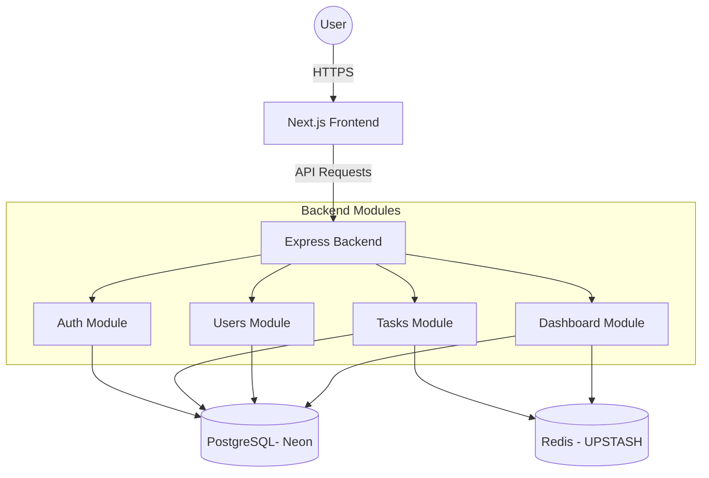
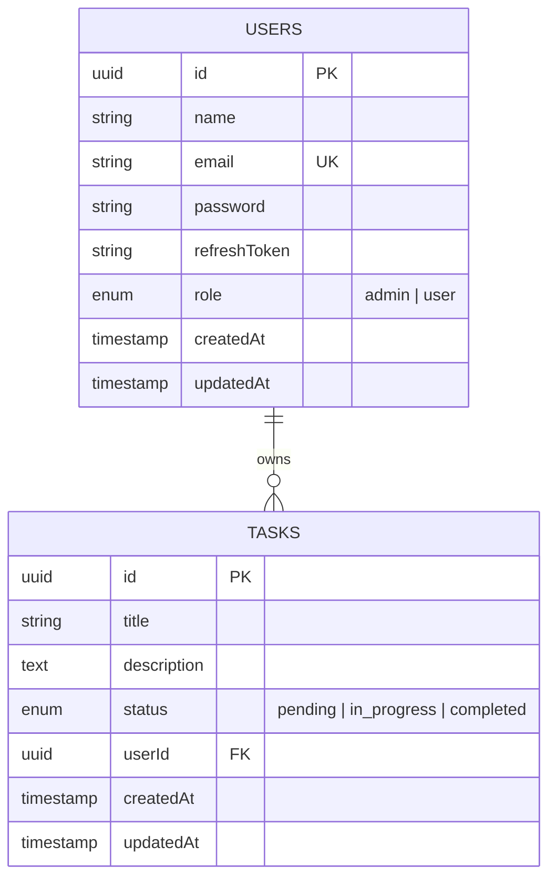

# TaskFlow - Full Stack Task Management System
 
TaskFlow is a robust, full-stack application designed for efficient task management with secure authentication, role-based access control (RBAC), and real-time dashboard analytics.
 
## 🚀 Project Overview
 
TaskFlow provides a seamless experience for users to manage their daily tasks while offering administrators powerful tools to oversee the entire platform. The system is built with a focus on performance, scalability, and clean code principles.
 
---
 
## ⚡ Quick Start (Setup Instructions)
 
### 🐳 Option 1: Running with Docker (Recommended)
 
The easiest way to get the app running with all dependencies (PostgreSQL, Redis) pre-configured.
 
1. **Prerequisites:** Install [Docker Desktop](https://www.docker.com/products/docker-desktop/).
2. **Launch:** Run the following command in the root directory:
   ```bash
   docker compose up --build
   ```
3. **Access:**
   - **Frontend:** [http://localhost:3000](http://localhost:3000)
   - **Backend API:** [http://localhost:5000/api](http://localhost:5000/api)
 
### 💻 Option 2: Running Locally (Without Docker)
 
Use this if you prefer to run services individually or use external databases.
 
#### 1. Backend Setup
 
1. Navigate to the backend folder: `cd backend`
2. Install dependencies: `npm install`
3. Create a `.env` file based on `.env.example`.
4. Start the dev server: `npm run dev`
 
#### 2. Frontend Setup
 
1. Navigate to the frontend folder: `cd frontend`
2. Install dependencies: `npm install`
3. Start the dev server: `npm run dev`
 
---
 
## 👤 Default Admin Credentials
 
An admin account is automatically created on startup:
 
- **Email:** `admin@gmail.com`
- **Password:** `admin123`
 
---
 
## 🛠️ Technology Stack
 
### Frontend
 
- **Framework:** [Next.js 15](https://nextjs.org/) (App Router)
- **Styling:** [Tailwind CSS 4](https://tailwindcss.com/)
- **State Management:** [Zustand](https://github.com/pmndrs/zustand)
- **Data Fetching:** [TanStack Query v5](https://tanstack.com/query/latest)
- **Icons:** [Lucide React](https://lucide.dev/)
- **Key Features:**
  - Feature-based Modular Architecture
  - Mobile Responsive Design
  - Dark Mode (System & Manual Toggle)
  - JWT Authentication with Silent Refresh
 
### Backend
 
- **Runtime:** [Node.js](https://nodejs.org/)
- **Framework:** [Express.js](https://expressjs.com/) with TypeScript
- **Database:** [PostgreSQL](https://www.postgresql.org/) (Direct or via [Neon](https://neon.tech/))
- **ORM:** [TypeORM](https://typeorm.io/)
- **Caching:** [Redis](https://redis.io/) (Local or via [Upstash](https://upstash.com/))
- **Validation:** [class-validator](https://github.com/typestack/class-validator) & [class-transformer](https://github.com/typestack/class-transformer)
- **Security:**
  - HTTP-only Access & Refresh Tokens
  - Role-Based Access Control (RBAC)
 
### Infrastructure
 
- **Containerization:** Docker & Docker Compose
 
---
 
## 🏗️ Architecture Overview
 
The system follows a **Modular Clean Architecture**, which decouples feature logic into self-contained modules.
 

 
### Folder Structure
 
```text
project-root/
├── backend/
│   ├── src/
│   │   ├── config/           # App, Database & Redis configuration
│   │   ├── modules/          # Feature-based modular logic
│   │   │   ├── auth/         # Authentication & RBAC
│   │   │   ├── tasks/        # Task management domain
│   │   │   ├── users/        # User administration
│   │   │   └── dashboard/    # Analytics & Aggregations
│   │   ├── entities/         # TypeORM Database Models
│   │   ├── middlewares/      # Auth, Error handling, Validation
│   │   └── utils/            # JWT, Logger, Hashing
├── frontend/
│   ├── app/                  # Next.js App Router (Pages & Layouts)
│   ├── components/           # Reusable UI components
│   │   ├── ui/               # Generic UI elements (Button, Input)
│   │   └── ...               # Domain components (Navbar, TaskModal)
│   ├── hooks/                # Custom React hooks (useAuth, useTasks)
│   ├── store/                # Zustand global state (Auth)
│   ├── lib/                  # API client (Axios) configuration
│   └── types/                # Global TypeScript definitions
└── docker-compose.yml        # Orchestration for the entire stack
```
 
---
 
## 📊 Database Schema
 

 
---
 
## 📡 API Documentation (Summary)
 
| Method | Endpoint               | Description                               | Auth       |
| ------ | ---------------------- | ----------------------------------------- | ---------- |
| POST   | `/api/auth/register`   | Create a new account                      | Public     |
| POST   | `/api/auth/login`      | Authenticate & get tokens                 | Public     |
| POST   | `/api/auth/refresh`    | Refresh access token                      | Public     |
| GET    | `/api/tasks`           | Get all tasks (User: own, Admin: own)     | User/Admin |
| POST   | `/api/tasks`           | Create a new task                         | User       |
| PATCH  | `/api/tasks/:id`       | Update task status/details                | User/Admin |
| DELETE | `/api/tasks/:id`       | Remove a task                             | User/Admin |
| GET    | `/api/dashboard/stats` | Get aggregate analytics (User/Admin: own) | User/Admin |
| GET    | `/api/users`           | List all users                            | Admin      |
| DELETE | `/api/users/:id`       | Delete a user                             | Admin      |
 
---
 
## 🧠 Design Decisions & Trade-offs
 
- **Hybrid Service Support:** The system is designed to work both with local Dockerized services and high-perf external services like **Neon** and **Upstash**. This provides the best of both worlds: easy local development and production-ready performance.
- **Next.js App Router:** Leveraged for simplified routing and built-in optimization. Trade-off: Slightly steeper learning curve for developers new to React 19/Server Components.
- **TypeORM Indexes:** We use composite and individual indexes on `userId` and `status` to ensure sub-millisecond query times even as the dataset grows.
 
## ⚠️ Known Limitations
 
- No file upload support for task attachments yet.
- Social login (OAuth) is not implemented.
- Real-time updates via WebSockets are pending.
 
## 🔮 Future Improvements
 
- [ ] Implement WebSocket notifications for real-time task changes.
- [ ] Add support for task "Categories" or "Labels".
- [ ] Detailed audit logs for admin actions.
- [ ] Password reset flow via email.
 