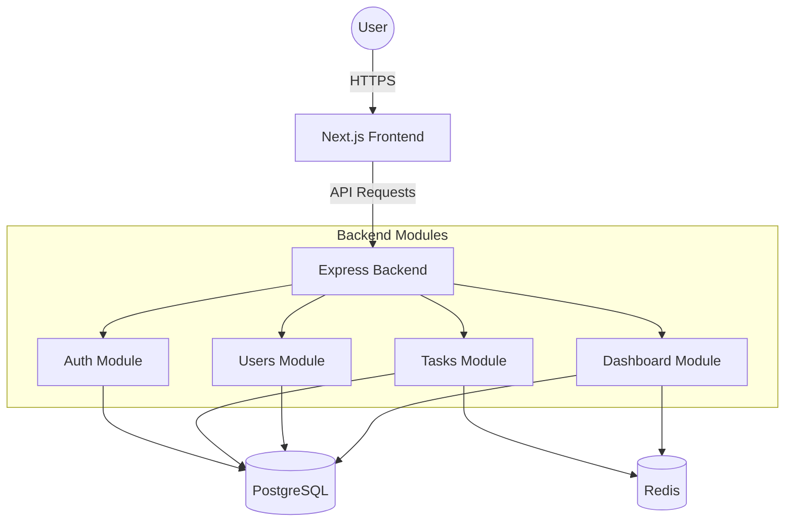
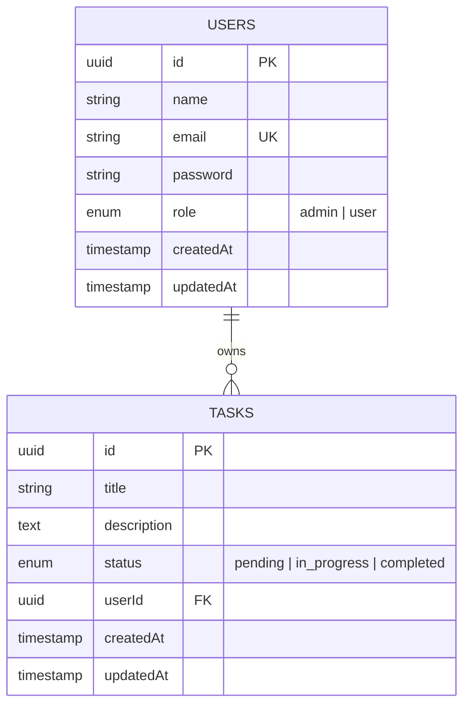

# TaskFlow - Full Stack Task Management System

TaskFlow is a robust, full-stack application designed for efficient task management with secure authentication, role-based access control (RBAC), and real-time dashboard analytics.

## 🚀 Project Overview
TaskFlow provides a seamless experience for users to manage their daily tasks while offering administrators powerful tools to oversee the entire platform. The system is built with a focus on performance, scalability, and clean code principles.

## 🛠️ Technology Stack

### Frontend
- **Framework:** [Next.js 15](https://nextjs.org/) (App Router)
- **Styling:** [Tailwind CSS 4](https://tailwindcss.com/)
- **State Management:** [Zustand](https://github.com/pmndrs/zustand)
- **Data Fetching:** [TanStack Query v5](https://tanstack.com/query/latest)
- **Icons:** [Lucide React](https://lucide.dev/)

### Backend
- **Runtime:** [Node.js](https://nodejs.org/)
- **Framework:** [Express.js](https://expressjs.com/) with TypeScript
- **Database:** [PostgreSQL](https://www.postgresql.org/) (Direct or via [Neon](https://neon.tech/))
- **ORM:** [TypeORM](https://typeorm.io/)
- **Caching:** [Redis](https://redis.io/) (Local or via [Upstash](https://upstash.com/))
- **Validation:** [class-validator](https://github.com/typestack/class-validator) & [class-transformer](https://github.com/typestack/class-transformer)

### Infrastructure
- **Containerization:** Docker & Docker Compose

---

## 🏗️ Architecture Overview

The system follows a **Modular Clean Architecture**, which decouples feature logic into self-contained modules.



### Folder Structure
```text
project-root/
├── backend/
│   ├── src/
│   │   ├── config/           # App, Database & Redis configuration
│   │   ├── modules/          # Feature-based modular logic
│   │   │   ├── auth/         # Authentication & RBAC
│   │   │   ├── tasks/        # Task management domain
│   │   │   ├── users/        # User administration
│   │   │   └── dashboard/    # Analytics & Aggregations
│   │   ├── entities/         # TypeORM Database Models
│   │   ├── middlewares/      # Auth, Error handling, Validation
│   │   └── utils/            # JWT, Logger, Hashing
├── frontend/
│   ├── app/                  # Next.js App Router (Pages & Layouts)
│   ├── components/           # Reusable UI components
│   ├── store/                # Zustand global state (Auth)
│   ├── lib/                  # API client (Axios) configuration
│   └── hooks/                # Custom React hooks
└── docker-compose.yml        # Orchestration for the entire stack
```

---

## 📊 Database Schema



---

## 📡 API Documentation (Summary)

| Method | Endpoint | Description | Auth |
|--------|----------|-------------|------|
| POST | `/api/auth/register` | Create a new account | Public |
| POST | `/api/auth/login` | Authenticate & get token | Public |
| GET | `/api/tasks` | Get all tasks for user | User |
| POST | `/api/tasks` | Create a new task | User |
| PATCH | `/api/tasks/:id` | Update task status/details | User |
| DELETE | `/api/tasks/:id` | Remove a task | User |
| GET | `/api/dashboard/stats` | Get aggregate analytics | User |
| GET | `/api/users` | List all users | Admin |
| DELETE | `/api/users/:id` | Delete a user | Admin |

---

## ⚙️ Setup Instructions

### 🐋 Docker Execution (Supports Neon & Upstash)
1. Ensure Docker and Docker Compose are installed.
2. The `docker-compose.yml` automatically picks up variables from your environment or `.env` file.
3. If you want to use **Neon DB** and **Upstash Redis**, ensure `DATABASE_URL`, `UPSTASH_REDIS_REST_URL`, and `UPSTASH_REDIS_REST_TOKEN` are set in your `backend/.env`.
4. Run the following command:
   ```bash
   docker-compose up --build
   ```
5. If using external services, the internal `postgres` and `redis` containers will still start but the backend will prioritize the external URLs.

### 💻 Local Development
1. **Backend:**
   ```bash
   cd backend
   npm install
   # Configure backend/.env with DATABASE_URL (Neon) and UPSTASH vars
   npm run dev
   ```
2. **Frontend:**
   ```bash
   cd frontend
   npm install
   npm run dev
   ```

---

## 🧠 Design Decisions & Trade-offs
- **Hybrid Service Support:** The system is designed to work both with local Dockerized services and high-perf external services like **Neon** and **Upstash**. This provides the best of both worlds: easy local development and production-ready performance.
- **Next.js App Router:** Leveraged for simplified routing and built-in optimization. Trade-off: Slightly steeper learning curve for developers new to React 19/Server Components.
- **TypeORM Indexes:** We use composite and individual indexes on `userId` and `status` to ensure sub-millisecond query times even as the dataset grows.

## ⚠️ Known Limitations
- No file upload support for task attachments yet.
- Social login (OAuth) is not implemented.
- Real-time updates via WebSockets are pending.

## 🔮 Future Improvements
- [ ] Implement WebSocket notifications for real-time task changes.
- [ ] Add support for task "Categories" or "Labels".
- [ ] Detailed audit logs for admin actions.
- [ ] Password reset flow via email.
